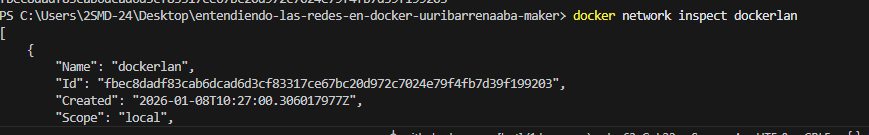

1. ¿Qué comando de consola usarías para ver todas las redes que existen actualmente en tu Docker? 
2. docker network ls
3. Explica con tus palabras: ¿Por qué es mucho más cómodo usar una "User-defined bridge" en lugar de la red por defecto?
4. En la user defined brigde tienes un servidor dns pudiendo resolver las ips con nombres y en la normal no, necesitas poner la ip del contenedor. 
5. Tiene mas opciones de personalizacion.
6. Si uso el driver `host`, ¿puedo mapear puertos con `-p 8080:80`? ¿Por qué?
7. No el host usa los puertos y la ip del ordenador y del contenedor asi que no podras mapear puertos.
8. 
9. Investiga: ¿Qué comando usas para ver los detalles de una red (qué contenedores están conectados, sus IPs, etc. Añade la palabra fuenterior a la respuesta.)? 
Docker network inspect

